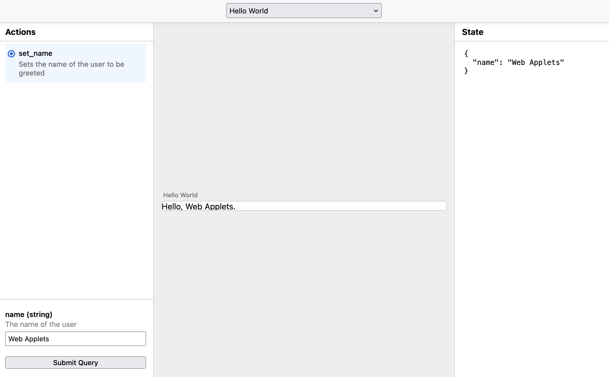

# Web Applets

> An open spec & SDK for creating apps that agents can use.

🔗 [Applets Repo](https://github.com/unternet-co/community-applets) | 🔗 [Mailing List](https://groups.google.com/a/unternet.co/g/community) | 🔗 [Applets Chat Demo](https://github.com/unternet-co/applets-chat)

## What is it?

Web Applets is an open specification for building software that both humans and AI can understand and use together. Instead of forcing AI to operate traditional point-and-click apps built for humans, Web Applets creates a new kind of software designed from the ground up for seamless human-AI collaboration.


Web Applets are modular pieces of web software that:

- Can be used directly by humans with rich, graphical interfaces
- Can be understood and operated by AI through a clear protocol
- Run locally in your environment, not on distant servers
- Share context and state with their environment
- Can be freely combined and composed

Think of any web software you use today - maps, documents, shopping, calendars - and imagine if instead of visiting these as separate websites, you could pull them into your own environment where both you and AI could use them together seamlessly.

Web Applets aims to do for AI-enabled software what the web did for documents - create an open platform where anyone can build, share, and connect applications. We believe the future of software should be built on open collaboration, not tight integration with closed platforms.

## Key Features

- **Built on Web Standards:** Create applets using familiar web technologies (HTML, CSS, JavaScript)
- **AI-Native Protocol:** Applets expose their state and actions in a way AI can understand and use
- **Rich Interfaces:** Full support for complex graphical UIs, not just text
- **Local-First:** Runs in your environment, keeping your data under your control
- **Composable:** Applets can work together, sharing context and state
- **Open Standard:** Designed for interoperability, not platform lock-in

## Example

This is a simple applet that prints "Hello, [your name]" when given the `set_name` action.

`index.html`:

```html
<!DOCTYPE html>
<html lang="en">
  <script src="./main.js" type="module"></script>
  <body>
    Hello! <span id="name">whoever you are</span>.
  </body>
</html>
```

`main.js`:

```js
import { appletContext } from '@web-applets/sdk';

// Get view element we want to manipulate
const nameElem = document.getElementById('name');

// Connect to the applet context
const applet = appletContext.connect();

// When the set_name action is called, change the state
applet.setActionHandler('set_name', ({ name }) => {
  applet.setState({ name });
});

// Whenever we get a request to render the view, update the name
applet.onrender = () => {
  nameElem.innerText = applet.state?.name;
};
```

`manifest.json`:

```json
{
  "type": "applet",
  "name": "Hello World",
  "description": "Displays a greeting to the user.",
  "entrypoint": "index.html",
  "actions": [
    {
      "id": "set_name",
      "description": "Sets the name of the user to be greeted",
      "params": {
        "name": {
          "type": "string",
          "description": "The name of the user"
        }
      }
    }
  ]
}
```

## Getting started

Install the applets SDK & CLI:

```bash
npm i --save @web-applets/sdk
npm i --save-dev @web-applets/cli
```

Then, initialize the `applets.config.json` and create a new blank applet:

```bash
npx applets init
npx applets create <your-applet-name>
```

This creates an applet folder, with a build system built-in using Vite. You can change this to anything you want. We recommend building at this stage, as the SDK currently needs to be bundled. We're working on adding a statically hosted script to import.

Inside your applet folder, you'll find a basic web app setup:

- `public/manifest.json`: This file describes the Applet, and tells the model what actions are available and what parameters each action takes
- `index.html`: Much like a website, this holds the main page for your applet
- `src/main.ts`: Declares functions that respond to each action, and a render function that updates the view based on state

> Want to use React? Svelte? Vue? – No problem, just install the dependencies and create an app the way you normally would in a website. So long as you're receiving the action events, it will all just work.

Let's say we want our applet to respond to a "set_name" action and render the user's name. In our `manifest.json` file we can write:

```js
{
  // ...
  "actions": [
    {
      "id": "set_name",
      "description": "Sets the name of the user to be greeted",
      "params": {
        "name": {
          "type": "string",
          "description": "The name of the user"
        }
      }
    }
  ]
}
```

Now let's update `src/main.ts` to assign an action handler:

```js
// First, import the SDK
import { appletContext } from '../../sdk/src';

// Now connect to the applet runtime
const applet = appletContext.connect();

// Attach the action handler, and update the state
applet.setActionHandler('set_name', ({ name }) => {
  applet.setState({ name });
});
```

When this state updates, it will inform the client which can then store the state somewhere, for example in a database so the applet will persist between uses.

Finally, we need to render the applet whenever a render signal is received. Again in `main.ts`:

```js
// ...

applet.onrender = () => {
  document.body.innerText = `Hello, ${applet.state.name}!`;
};
```

Now if you run `npx applets playground`, you should be able to test out your new applet action directly. This applet will now work in any environment where the SDK is installed.



## Integrating Web Applets into your client

Using Web Applets is just as easy as creating them!

First, build your applets. By default, this goes into a folder called `dist/`, but you'll likely want to change this in `applets.config.json` to point to wherever you're serving public files from. For example, in a Vite project, edit this to be `./public`.

Then, run:

```bash
npx applets build
```

Now in your main app, you can import the applets client:

```js
import { applets } from '@web-applets/sdk';
```

Now you can import your applets from wherever they're being served from (note – you can also host them anywhere on the web):

```js
const applet = await applets.load('/helloworld.applet'); // replace with a URL if hosted remotely
applet.onstateupdated = (state) => console.log(state);
applet.dispatchAction('set_name', { name: 'Web Applets' });
```

The above applet is actually running headless, but we can get it to display by attaching it to a container. For the loading step, instead run:

```js
const container = document.createElement('iframe');
document.body.appendChild(container);
const applet = await applets.load(`/helloworld.applet`, container);
```

To load pre-existing saved state into an applet, simply set the state property:

```js
applet.state = { name: 'Ada Lovelace' };
// console.log: { name: "Ada Lovelace" }
```

It may also be helpful to check available applets at a domain, or in your public folder. For that you can extract the applet headers from the App Manifest at the public root (`/manifest.json`), and see the available applets and a shorthand for the actions you can take in them. This is automatically created when you build your applets.

```js
const applets = await applets.list('/');
```

This applets object looks like:

```js
{
  '/helloworld.applet': {
    name: 'Hello World',
    description: 'Displays a greeting to the user.',
    url: '/applets/helloworld.applet',
    actions: {
      set_name: {
      description: 'Sets the name of the user to be greeted',
      params: {
        name: {
          type: 'string',
          description: 'The name of the user'
        }
      },
    },
  },
  // ...
};
```

You can use it to present a quick summary of available tools to your model, and then decide on an applet and action to use.

## Feedback & Community

This is a community project, and we're open to community members discussing the project direction, and submitting code!

To join the conversation, visit the Applets mailing list at [groups.google.com/a/unternet.co/g/community](https://groups.google.com/a/unternet.co/g/community). You can also find more about the company that's kicking off this work at [unternet.co](https://unternet.co)

## License

[MIT](./LICENSE.md)

---

Built by [Unternet](https://unternet.co).
