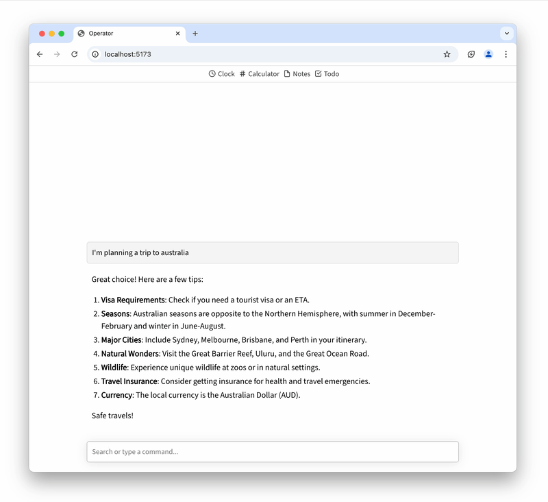

# Web Applets

> An open spec & SDK for creating web apps that agents can use.

🌐 [Docs](https://unternet.co/docs) | 👾 [Community Discord](https://discord.gg/VsMuEKmqvt) | 💌 [Mailing List](https://buttondown.com/unternet)

[](https://builders.mozilla.org/)

Web Applets is a [Mozilla Builders](https://builders.mozilla.org/) project.

## What is it?

**Web Applets is an open specification for building software that both humans and AI can understand and use together.** Instead of forcing AI to operate traditional point-and-click apps built for humans, Web Applets creates a new kind of web software designed for human-AI collaboration. You can read more about it on our website.

Read [the docs](https://unternet.co/docs/web-applets/introduction)!



## Feedback & Community

This is a community project, and we're open to community members discussing the project direction, and submitting code!

- Join the [mailing list](https://buttondown.com/unternet).
- Follow [our blog](https://unternet.co/blog) for regular updates
- Join [our discord](https://discord.gg/VsMuEKmqvt)

## Get the codebase running

```sh
npm install
npm run build
```

## License

[MIT](./LICENSE.md)

---

Built by [Unternet](https://unternet.co).
