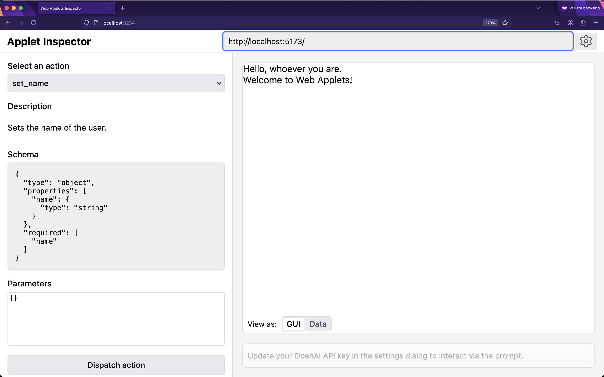

# Web Applets

> An open spec & SDK for creating web apps that agents can use.

👾 [Community Discord](https://discord.gg/2aUvMe8HrC) | 💌 [Mailing List](https://groups.google.com/a/unternet.co/g/community)

[](https://builders.mozilla.org/)

Web Applets is a [Mozilla Builders](https://builders.mozilla.org/) project.

## What is it?

**Web Applets is an open specification for building software that both humans and AI can understand and use together.** Instead of forcing AI to operate traditional point-and-click apps built for humans, Web Applets creates a new kind of web software designed for human-AI collaboration.


## Why?

[Unternet](https://unternet.co) is building a new, intelligent user agent that can do things for you across the web. As part of that effort, we needed a way to actuate an embedded web app. You can do this with a computer use model like [this one](https://docs.anthropic.com/en/docs/build-with-claude/computer-use), but they kind of suck in practice for user-facing work — they're error-prone, require blocking the UI & clicking on it, and have fundamental latency limits that are way too high. Why make a computer talk to another computer via a clumsy web interface when they can just talk directly?

Web Applets lets you define a simple, computer-readable API for a web app running in a browser, webview, or iframe. You can send it actions as JSON objects, which an LLM can easily create (see [OpenAI's structured JSON endpoint](https://openai.com/index/introducing-structured-outputs-in-the-api/)), and they can update their UI instantly in-place. Plus, you can expose the internal state of the applets to the model so you can do cool stuff like chat to a map.

We wanted anyone to be able to build these actions into their own third-party applets and distribute them. So, we extended the web & made it available to everyone!

## Getting started

Create a new web app using our CLI:

```bash
npx @web-applets/create
```

Inside the generated folder, you'll find a basic web app setup:

- `public/manifest.json`: A web app manifest, useful when publishing your applet, adding icons, etc.
- `index.html`: Much like a website, this holds the main page for your applet
- `src/main.ts`: Declares functions that respond to each action, and a render function that updates the view based on state

> Want to use React? Svelte? Vue? – No problem, just install the dependencies and create an app the way you normally would in a website. So long as you're receiving the action events, it will all just work.

Now let's build out a basic web applet that will say hello when we send it an action:

`index.html`:

```html
<!DOCTYPE html>
<html lang="en">
  <script src="./main.js" type="module"></script>
  <body>
    Hello! <span id="name">whoever you are</span>.
  </body>
</html>
```

Let's add some Web Applets functionality, so this can respond to a `set_name` action:

`main.js`:

```js
import { applets } from '@web-applets/sdk';

const context = applets.getContext();

// Define a 'set_name' action, and make it update the shared data object with the new name
context.defineAction('set_name', {
  params: {
    name: {
      type: string,
      description: 'The name of the person to be greeted.',
    },
  },
  handler: ({ name }) => (applet.data = { name }),
});

// Whenever the data is updated, update the view
context.ondata = () => {
  document.getElementById('name').innerText = applet.data.name;
};
```

To test out this applet, first start the dev server with `npm run dev`, and take note of the dev server URL. Then, fire up the Web Applets inspector by running `npx @web-applets/inspector`, and enter the dev URL into the URL bar up the top.



You can build this applet, by running `npm run build`, and host it on any static site host. This applet will now work in any environment where the SDK is installed.

## Integrating Web Applets into your client

In order to run, web applets need to be embedded in an environment that supports the Web Applets protocol. This might look like a browser (email me if you're interested!), or an electron app with `<webview>` tags, or sometthing as simple as a web-based AI chat client using iframes.

First, install & import the applets SDK in your client app:

```bash
npm install @web-applets/sdk
```

```js
import { applets } from '@web-applets/sdk';
```

Now you can import your applets from wherever they're being served from (note – you can also host them locally, or anywhere on the web):

```js
const applet = await applets.load('https://applets.unternet.co/maps');
applet.ondata = (e) => console.log(e.data);
applet.dispatchAction('set_name', { name: 'Web Applets' }); // console.log: { name: "Ada Lovelace" }
```

The above applet is actually running headless, but we can get it to display by attaching it to a container. For the loading step, instead run:

```js
const container = document.createElement('iframe');
document.body.appendChild(container);
const applet = await applets.load(`/helloworld.applet`, container);
```

To load pre-existing saved data into an applet, simply set the data property:

```js
applet.data = { name: 'Ada Lovelace' }; // console.log: { name: "Ada Lovelace" }
```

## Feedback & Community

This is a community project, and we're open to community members discussing the project direction, and submitting code!

To join the conversation, visit the Applets mailing list [here](https://groups.google.com/a/unternet.co/g/community). You can also find more about the company that's kicking off this work at [unternet.co](https://unternet.co)

## License

[MIT](./LICENSE.md)

---

Built by [Unternet](https://unternet.co).
