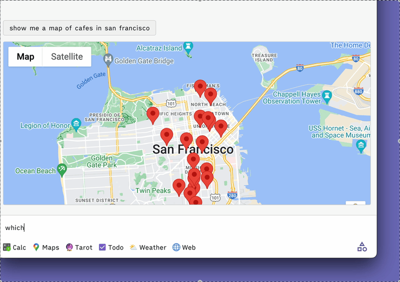

# Introduction to Web Applets

Web Applets is an SDK, protocol and set of standards for building software that both humans and AI can understand and use together. It's built to be a light-weight layer over the existing web, that makes web apps legible to external systems, which can in turn send actions to them and receive data.

> Want to try one out now? In your terminal (with Node installed) run `npx @web-applets/inspector` and in the Inspector's URL bar paste the link of an applet from our [directory](/directory).

The project is MIT-licensed, and source code is hosted on GitHub <a href="https://github.com/unternet-co/web-applets" target="_blank">here</a>.

<figure>

<figcaption>An example of our web applet client loading a map applet in response to a query, then responding to a follow-up question by reading the map's data.</figcaption>
</figure>

## Why?

[Unternet](https://unternet.co) is building a new, intelligent user agent that can do things for you across the web. As part of that effort, we needed a way to use client-side web software. You can do this with a computer use model, but for many use cases it's not suitable to point and click around in a virtual browser. Why make a computer talk to another computer via a clumsy web interface when they can just talk directly?

Web Applets lets you define a simple, computer-readable API for a web app running in a browser, or embedded webview or iframe. You can read possible actions with parameters in tool-use-compatible `JSONSchema` format, send them actions. In turn, applets can handle actions however they'd like, update ther interfaces, and respond with a data object that gives the LLM visibility on what's happening inside.

This allows you to do cool things &mdash; like drop pins on a map directly in an AI chat app, navigate a web page using your voice, or solve a crossword collaboratively with an AI.

## Where can this be used?

The simplest use of Web Applets is to serve rich **interactive widgets** in response to user queries in **AI chat applications**. For example, if a user asks about the weather, you can show an interactive user interface with a graphical forecast for the next seven days, instead of just calling an API and giving a text response.

We think a particularly compelling use case will be embedding small, focused, portable apps that exist within a larger **intelligent client** environment, allowing models to coordinate multiple applets in response to user queries. This is what we're in the process of building.

However, there are also compelling use cases in **web browsers** and **browser extensions**, conducting actions on the active page (e.g. interacting with a design app using natural language).

## Let's keep our web open

Unternet is a <a href="https://www.cooleygo.com/faq-delaware-public-benefit-corporations/" target="_blank">Public Benefit Corporation</a> with a mission to increase user agency &amp; software interoperability on the web.

We believe a new kind of AI-native software will be the foundation for the next phase of computing &amp; the web. But if one proprietary platform dominates this, instead of a shared standard anyone can participate in, then the open web as we know it will be at risk.

We're open sourcing Web Applets because we believe that the future of the web needs to be open. Web Applets can be implemented by any client, can be hosted anywhere on the web, and indexed by anyone.

## Getting started

To get stuck right into code, view the [Quickstart](/docs/web-applets/quickstart). We recommend you review Web Applets [Concepts](/docs/web-applets/concepts) before you start.

When you're ready to go further, our [API reference](docs/web-applets/reference) contains everything you need to create & use web applets in production.
