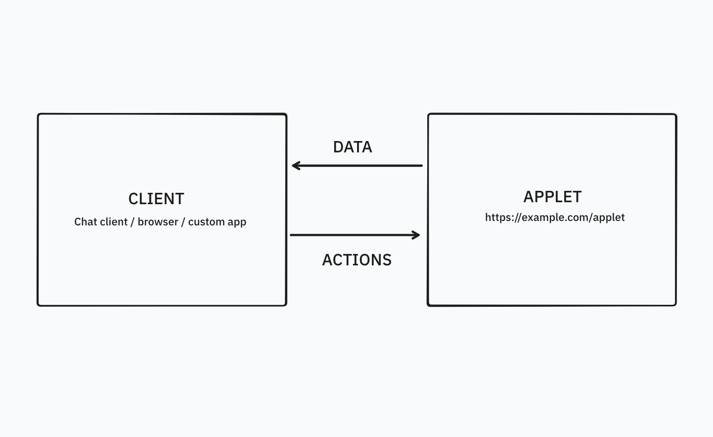

# Concepts

The Web Applets protocol is implemented by a **client** (e.g. a browser, extension, or dedicated app) and an **applet** (which is a web app). Using this protocol, the Web Applets SDK establishes a connection allowing the host to send **actions** to the applet, and receive **data** when the applet's internal state is updated.

<figure>

<figcaption>A rough schematic of data transfer between an applet and a client. The applet is typically embedded in an iframe or webview within the client, and uses a message passing protocol to exchange data.</figcaption>
</figure>

## What makes an applet?

At its core, an applet is any website that implements the Web Applets protocol. Applets do this by creating a connection with the host window, typically through `applets.register()`.

For example, this is an applet:

```html
<html>
  <head>
    <script src="web-applets.min.js"></script>
    <script>
      applets.register();
    </script>
  </head>
  <body></body>
</html>
```

This applet can now declare actions using <a href="/docs/web-applets/reference/applet-scope#defineAction">`defineAction()`</a>.

## Rendering an applet

Web Applets should be a simple addition to any web application rendering process, whether that's a basic HTML website, or a complex React application. Because an applet is just a website, you can use whatever process you use to update HTML to update your applet's interface.

### Data-driven rendering pattern

If you're building an applet to run as an embedded application (for example, an AI chat widget), we recommend using action handlers primarily as functions to update the `data` object. You can then update the view in the `data` event handler.

This ensures that&mdash;assuming the client is storing and persisting your applet's data&mdash;your applet's state can be rehydrated when the page is reloaded.

```js
self.setActionHandler('search', async () => {
  this.data = await getSearchResults();
});

self.ondata = () => {
  renderView(self.data);
};
```

## Optimizing for model-legibility

You should assume that the metadata (whatever is in the <a href="/docs/web-applets/reference/manifest">`Manifest`</a> or provided to the <a href="/docs/web-applets/reference/applet-factory#register">`applets.register()`</a> method), the `actions` property, and the `data` property of your applet will be available in the context of the model that is deciding what actions to take with your applet.

Therefore, consider what would be helpful to add to these objects in order to maximize the likelihood that a model can use your applet effectively. For example:

- Ensure you add a descriptive name and description to your applet's manifest
- Add detailed descriptions to action definitions, detailing expected behaviour, how the action should be used, and in what contexts
- Add any relevant information that the model might need in order to answer questions from the user, or understand what actions to take, in the `data` property

Remember that if something is not declared explicitly in the applet's properties, it's unlikely to be perceived by the model. For more on best practices for tool calling, see <a href="https://docs.anthropic.com/en/docs/build-with-claude/tool-use/overview" target="_blank">Anthropic's guide</a> on the topic.

For now, there isn't any explicit prompt manipulation as part of Web Applets, but you can still provide additional context. For example, in developing the "Crossword" applet, we found that adding a "hints" property to the data object meant we could provide additional information to the model to not give away the clues.

## Security & privacy

Web Applets is designed with security in mind. That's one of the reasons we architected the SDK to work with _websites_, instead of relying on importing ES modules or components directly. By using the web, we can leverage the existing browser same-origin security model to ensure applets are sandboxed from other processes.

If you're implementing a Web Applets client, we recommend you load applets in a <a href="https://developer.mozilla.org/en-US/docs/Web/API/HTMLIFrameElement/sandbox" target="_blank">sandboxed iframe</a>, or some other independent web scope. This ensures that running applets don't have same-origin permission to read resources like `localStorage`, `IndexedDB`, the active window's DOM, and other sensitive resources.
